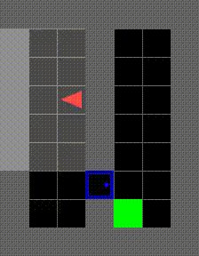
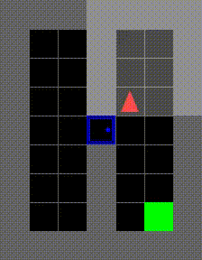
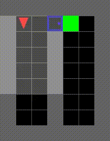
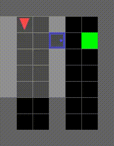
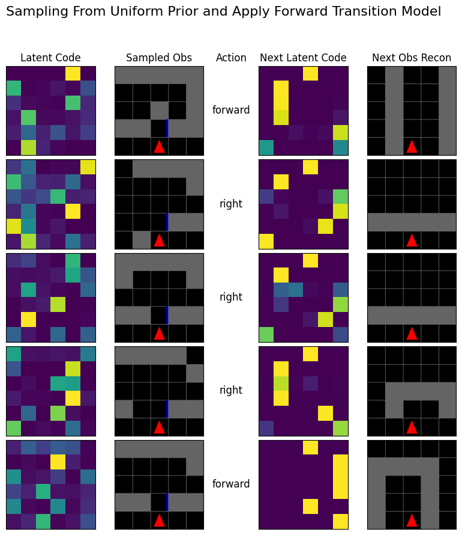
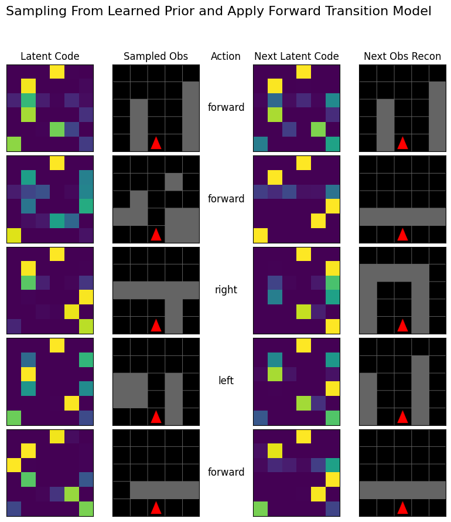

# Learning My First World Model

This tutorial explores model-based reinforcement learning with a focus on learning world models. It's designed for students, researchers, and anyone interested in sequential decision-making under uncertainty. Since it's still under active development, some sections might be missing content or explanations. 

<p align="center">
  
</p>

## Introduction

Model-based Reinforcement Learning (RL) leverages explicit models of the environment to achieve greater data efficiency than model-free approaches. However, these models are often incomplete, imperfect, or computationally expensive to construct. To address these challenges, data-driven statistical methods, such as learning from experience or system identification, offer a way to recover approximate (surrogate) models of the world. World model learning represents a powerful framework for capturing the dynamical state and feature-space representation of the environment.

This repo contains tutorials that motivate the interest for learning world models by examining fundamental algorithms for sequential decision-making under uncertainty. We will demonstrate how increasing task complexity and decreasing observability expose the limitations of traditional approaches, motivating the need for model-based data-driven solutions.

The tutorials cover:
*   Introduction to the Minigrid environments.
*   Basic concepts of sequential decision-making under uncertainty. 
*   Limitations of traditional model-based methods.
*   Introduction to world model learning, with a focus on neuro-symbolic world models and my research in this area.

The tutorial is notebook-based, allowing you to run and modify Python code, adjust hyperparameters, and observe the impact on decision-making performance. It leverages open-source tools such as Farama's RL Gyms and the Minigrid Environment. Make sure to check out the [Disclaimer](#disclaimer) section.

There will be supplementary slides (ppt) to the tutorial and they will be linked here in the future. 
Some design decisions were made to allow local running of the deep learning methods. Training of the neural networks with default configs should take less than ~5 mins on a MacBook Air M2 with 8GB, even with about 20 browser tabs open.

Below are results after learning a world model and training Dyna-Q type policy that leverages the world model for both representation and mental simulation. 

<p align="center">
  
  
  
  
</p>

<p align="center">
  
  
</p>

## Getting Started

### Prerequisites
- Python 3.10
- Main packages used: `gymnasium`, `minigrid`, `torch` (see [requirements.txt](requirements.txt)).
- You may need to install `ffmpeg` for the rendering components, installation will depend on your system.

### Installation
1. Clone the repository:

   ```bash
   git clone https://github.com/alcedok/my-first-world-model.git
   cd my-first-world-model
   ```
2. Create a virtual environment (recommended):

    It's highly recommended to create a virtual environment to isolate your project's dependencies. You can use your code editor's built-in features (e.g., VS Code's Python environments) or set it up manually:

    **Manual Setup:**

    ```bash
    # create the virtual environment
    python3 -m venv .venv  # use python on Windows if python3 is not available

    # activate the virtual environment
    # on Linux/macOS:
    source .venv/bin/activate
    # on Windows:
    .venv\Scripts\activate
    ```

3. Install dependencies:
    ```bash
    pip install -r requirements.txt
    ```
4. Open and run notebooks in `tutorial/*.ipynb` 
   - see the [Running the Notebooks](#running-the-notebooks) section for more details.

## Tutorial Content

This tutorial is divided into the following notebooks:

*   **Environment (`tutorial/00-environment.ipynb`)** 
*   **Markov Decision Process (MDP) (`tutorial/01-mdp.ipynb`)** 
*   **Partially-Observable MDP (POMDP) (`tutorial/02-pomdp.ipynb`)** 
*   **Learning World Models (`tutorial/03-learning_world_models.ipynb`)**


## Running the Notebooks

This project uses Jupyter Notebooks for interactive exploration and tutorials. You can run the notebooks in several ways:

**1. Using a Code Editor with a Jupyter Plugin (Recommended):**

If you use a code editor (e.g., VS Code) with Jupyter support:

*   Open the `.ipynb` file in your editor.
*   Use your editor's interface to run the notebook cells. Refer to your code editor's documentation for any specific instructions/configuration.

**2. Using JupyterLab:**

If you have JupyterLab installed:
*   Open your terminal, navigate to the project directory, and run: `jupyter lab`
*   In JupyterLab's file browser, navigate to and open the notebook you want to run (`.ipynb` file).
*   Run the notebook cells.

**3. Using the Command Line (Jupyter Notebook or JupyterLab):**

*   Open your terminal and navigate to the project directory.
*   To open the notebook in the classic Notebook interface, run: `jupyter notebook <notebook_name.ipynb>` or `jupyter notebook` to open the file browser.
*   To open the notebook in JupyterLab, run: `jupyter lab <notebook_name.ipynb>`
*   Run the notebook cells.


## Contributing
Contributions are welcomed! If you'd like to improve the tutorials, fix errors, or add new content, we encourage you to submit a pull request. Before contributing, please take a look at our contributing guidelines in [CONTRIBUTING.md](CONTRIBUTING.md). 

## Disclaimer

This repository is intended for educational purposes only and should not be used in production environments. The fields of sequential decision-making and reinforcement learning are vast and growing, and this tutorial is a bit biased towards my own research interests. It's not meant to be exhaustive (I even skip some fundamental formulation). Many others have already put in a ton of work creating great resources on the fundamentals and methods I'm covering here. Here are a few of them: 
- Kochenderfer, Wheeler and Wray's free textbook on [Algorithms for Decision Making (2022)](https://algorithmsbook.com/decisionmaking/)
- Professor Tim Miller's Jupyter Book on [Mastering Reinforcement Learning](https://gibberblot.github.io/rl-notes/index.html#)
- OpenAI's [Spinning Up in Deep RL](https://spinningup.openai.com/en/latest/)


## Citation

If you find this code useful, please reference it using:

```bibtex
@misc{alcedo2025tutorial,
  author = {Alcedo, Kevin and Lima, Pedro},
  title = {Learning My First World Model},
  year = {2025},
  howpublished = {\url{[https://github.com/alcedok/my-first-world-model](https://github.com/alcedok/my-first-world-model)}},
  note = {Accessed: [Date Accessed]},
}
```

## References 

References for the concepts and algorithms used in this tutorial can be found in [references.bib](references.bib).
